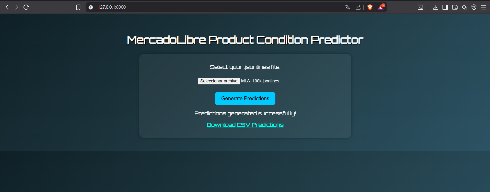
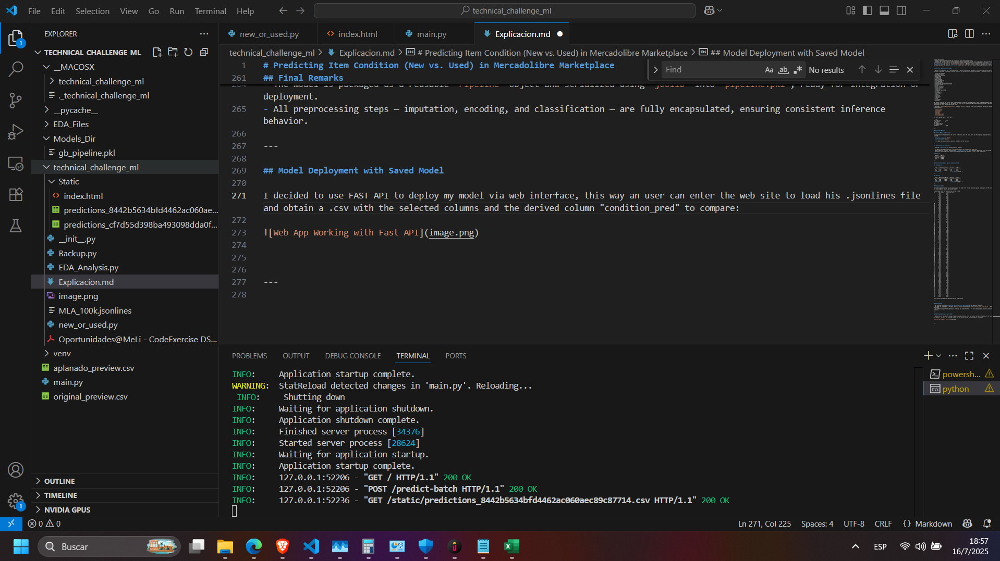

# Predicting Item Condition (New vs. Used) in Mercadolibre Marketplace





## Problem Statement

In the context of Mercadolibre's Marketplace, the goal is to build a machine learning algorithm capable of predicting whether a listed item is **new** or **used**, based solely on the data provided in the `MLA_100k.jsonlines` dataset.

The project consists of the following stages:

- Data analysis and preprocessing  
- Feature engineering and vectorization  
- Model selection and training  
- Hyperparameter optimization  
- Evaluation on held-out test data

---

## Dataset Overview

The dataset includes 100,000 items from the Argentinean marketplace. Each record contains metadata about a listed product, including title, price, attributes, shipping options, seller information, and more. The label of interest is `"condition"` which can take one of two values: `"new"` or `"used"`.

---

## Data Preparation and Cleaning

- All records are filtered to ensure they contain the `condition` field.
- Nested structures are flattened and unnecessary data fields are excluded.
- Special attention was given to variables with potentially duplicated meaning. In particular:
  - The fields `base_price` and `price` are found to be **identical in almost all records**, so `base_price` was dropped to reduce redundancy and compute time.
- A `DictVectorizer` was used for categorical encoding, and `SimpleImputer` handled missing values.

---

## Data Analysis

- I conducted a data exploration analysis (EDA) using **EDA_Analysis.py**, observing how data itself was, generating 4 main charts, condition_pie_chart, correlation_matrix_normalized, covariance_matrix_normalized and 9 histograms in relation to the top 9th of variables that better explain the variance.
- Nested structures are flattened and unnecessary data fields are excluded.
- Although the classes ("new" vs "used") are not severely imbalanced, slight class imbalance is addressed through the use of python to force train and test datasets to have the same number of registers for each class 50%/50%. In adition a **tree-based classifiers** is used,  this is `GradientBoostingClassifier`, which is robust to moderate imbalance for trying to improve previous failed predictions. In addition, **F1 Score** is used as a third metric to ensure balanced performance across both classes.


## Model and Optimization Strategy

I applied a PCA analysis but I found was better a manual definition of variables. Once I noticed how data was through the data analysis I mentioned previously I decided to select the variables for training the model. I selected finally the following:

- accepts_mercadopago
 - automatic_relist
 - available_quantity
 - buying_mode
 - category_id
 - currency_id
 - date_created
 - initial_quantity
 - last_updated
 - listing_type_id
 - non_mercado_pago_payment_methods
 - original_price
 - price
 - secure_thumbnail
 - seller_contact
 - seller_id
 - shipping_free_methods
 - site_id
 - sold_quantity
 - start_time
 - status
 - stop_time
 - sub_status
 - subtitle
 - title
 - variations
 - warranty

The general steps of the process were to explore data, preparing data and train a model with hiperparameter optimization,
continuing with model saving as .pkl format and using it for generating 100 random predictions based on the test dataset to demostrate how could be used the model generated with **new_or_used.py**.

I employed a `GradientBoostingClassifier` within a `sklearn` pipeline, tuned using randomized search over the following hyperparameters:

- `learning_rate`
- `n_estimators`
- `max_depth`
- `subsample`
- `min_samples_split`
- `min_samples_leaf`

The best hyperparameters found were:

```text
learning_rate:       0.1559
n_estimators:        148
max_depth:           8
min_samples_split:   2
min_samples_leaf:    3
subsample:           0.7359
```

---

## Evaluation Metrics

### Primary Metric: **Accuracy**

Accuracy measures the proportion of correct predictions over the total. This was the required baseline metric, and this model achieved:

- **Training accuracy:** `0.8804`  
- **Test accuracy:** `0.8715`

> ✅ The model surpasses the 0.86 accuracy threshold on the test set.

---

### Secondary Metric: **Recall**

I selected **Recall** as the secondary metric because:

- It captures the model’s ability to correctly identify all instances of each class.
- In a marketplace scenario, misclassifying a **used item as new** could severely impact user trust and system integrity.
- Therefore, maximizing recall ensures I correctly identify as many true `"used"` items as possible.

**Results:**

| Dataset   | Recall |
|-----------|--------|
| Training  | 0.8692 |
| Test      | 0.8588 |

---

## Classification Report against Condition field

### Training Set

| Class | Precision | Recall | F1-Score | Support |
|-------|-----------|--------|----------|---------|
| New   | 0.89      | 0.87   | 0.88     | 41618   |
| Used  | 0.87      | 0.89   | 0.88     | 41618   |
| **Accuracy** |       |        | **0.8804** | 83236   |

---

### Test Set

| Class | Precision | Recall | F1-Score | Support |
|-------|-----------|--------|----------|---------|
| New   | 0.88      | 0.86   | 0.87     | 4624    |
| Used  | 0.86      | 0.88   | 0.87     | 4624    |
| **Accuracy** |       |        | **0.8715** | 9248    |

---

## Prediction Sample

To validate generalization and the usability of the model file stored, this was applied to a sample of 100 test rows. Below are a few rows comparing real vs. predicted values:

Predicciones sobre 100 registros del set de prueba:
Id       Real class     Predicted class
0         new           used
1        used           used
2         new            new
3        used           used
4        used           used
5        used           used
6         new            new
7        used           used
8         new            new
9        used            new
10        new            new
11       used           used
12       used            new
13        new           used
14       used           used
15       used           used
16        new            new
17       used           used
18        new            new
19        new            new
20       used           used
21       used           used
22       used           used
23       used           used
24        new            new
25       used           used
26        new            new
27       used           used
28       used           used
29        new            new
30        new            new
31        new            new
32        new            new
33       used           used
34        new            new
35        new            new
36        new           used
37       used           used
38       used           used
39        new            new
40        new            new
41       used           used
42       used            new
43       used            new
44       used           used
45        new           used
46        new            new
47       used            new
48        new            new
49        new            new
50        new           used
51        new            new
52        new            new
53       used           used
54        new           used
55        new            new
56        new            new
57       used           used
58       used           used
59       used           used
60        new            new
61        new           used
62        new           used
63        new            new
64       used           used
65        new            new
66       used           used
67       used           used
68        new            new
69        new            new
70       used           used
71       used           used
72       used           used
73        new            new
74        new            new
75        new            new
76       used           used
77       used           used
78       used           used
79       used           used
80       used           used
81        new            new
82        new            new
83        new            new
84       used           used
85       used            new
86       used           used
87        new            new
88        new            new
89       used           used
90        new            new
91        new            new
92       used           used
93       used           used
94       used           used
95       used           used
96       used           used
97        new            new
98       used           used
99       used           used

This confirms the model’s robustness across both classes.

---


## Final Remarks

- The proposed solution **exceeds the required accuracy threshold** on the held-out test set.
- The model is packaged as a reusable `Pipeline` object and serialized using `joblib` into `pipeline.pkl`, ready for integration or deployment.
- All preprocessing steps — imputation, encoding, and classification — are fully encapsulated, ensuring consistent inference behavior.

---

## Model Deployment with Saved Model

I decided to use FAST API to deploy my model via web interface through **main.py**, this way an user can enter the web site to load his .jsonlines file and obtain a .csv with the selected columns and the derived column "condition_pred" to compare:


To conserve active this model there is a necesity of having a virtual machine for compute resources, network management and set any requierements of data control. It's posible to use a repo and Cloud App Services to have a better experience.

---
